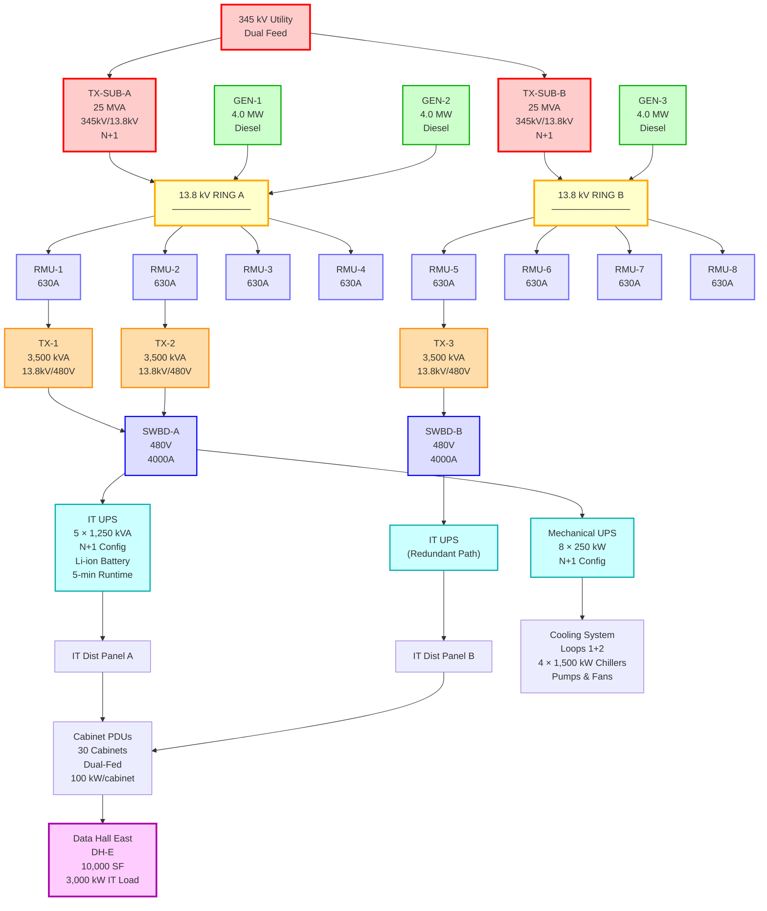

**Created:** 2025-11-03
**Tags:** #pryor-dc #sld #electrical #phase-1 #3mw
**Related:** [[7BOD - Electrical (CSI Div 26)]], [[_BOD - Exec Summary and TOC]]

# SINGLE-LINE DIAGRAM - PHASE 1 (3 MW)
## Pryor Data Center - PACHYDERM GLOBAL

**Revision:** 01
**Date:** 2025-11-03
**Prepared by:** PGCIS Engineering Team
**Status:** Design Development

---

## SYSTEM OVERVIEW

**Phase 1 Configuration:**
- **IT Capacity:** 3,000 kW (30 cabinets @ 100 kW each)
- **Data Halls:** DH-E operational, DH-W powered shell
- **Topology:** Dual-ring 13.8 kV MV distribution with N+1 redundancy
- **Target PUE:** 1.35
- **Target WUE:** <0.5 L/kWh (air-cooled, zero water)

---

## SINGLE-LINE DIAGRAM



---

## EQUIPMENT SUMMARY

### Utility & Substation

| Equipment | Quantity | Rating | Voltage | Redundancy | Notes |
|-----------|----------|--------|---------|------------|-------|
| **Utility Connection** | 1 | - | 345 kV | Dual-feed | Customer-owned substation |
| **Substation Transformers** | 2 | 25 MVA | 345kV/13.8kV | N+1 | Either can carry full load |

### Medium Voltage Distribution (13.8 kV)

| Equipment | Quantity | Rating | Type | Notes |
|-----------|----------|--------|------|-------|
| **Ring Main Units (RMUs)** | 8 | 630A | SF6/Vacuum | 4 per ring, SCADA controlled |
| **13.8 kV Ring** | 2 | - | Dual-ring | Self-healing topology |

### Generators (Phase 1)

| Equipment | Quantity | Rating | Fuel | Runtime |
|-----------|----------|--------|------|---------|
| **Diesel Generators** | 3 | 4.0 MW @ 13.8 kV | Diesel (Tier 4 Final) | 24 hours (central fuel) |
| **N+1 Capacity** | - | 8.0 MW | - | 2 units carry full load |

### Step-Down Transformers (Phase 1)

| Equipment | Quantity | Rating | Voltage | Type |
|-----------|----------|--------|---------|------|
| **MV/LV Transformers** | 3 | 3,500 kVA | 13.8 kV/480V | Oil-filled, ONAN |
| **N+1 Capacity** | - | 7.0 MVA | - | 2 units carry full load |

### UPS Systems (Phase 1)

| System | Modules | Module Rating | Total Capacity | Battery | Runtime | Function |
|--------|---------|---------------|----------------|---------|---------|----------|
| **IT UPS** | 5 | 1,250 kVA | 6,250 kVA | Li-ion | 5 min | IT loads (N+1) |
| **Mechanical UPS** | 8 | 250 kW | 2,000 kW | Li-ion/VRLA | 30-60 sec | HVAC loads (N+1) |

### Distribution & Loads

| Equipment | Quantity | Rating | Notes |
|-----------|----------|--------|-------|
| **LV Switchboards** | 2 | 480V, 4000A | SWBD-A fed from Ring A, SWBD-B from Ring B |
| **IT Distribution Panels** | Multiple | 480V | Dual-fed from different switchboards |
| **Cabinet PDUs** | 60 | 50 kW each | Dual PDUs per cabinet (2×50kW = 100kW) |
| **Data Hall Cabinets** | 30 | 100 kW/cab | DDC S-Series, 52U, 36" wide |

---

## LOAD CALCULATIONS

### IT Load (Critical)
```
Cabinets:           30 × 100 kW  = 3,000 kW
UPS Losses (8%):                    240 kW
Transformer Losses:                  60 kW
Distribution Losses:                 50 kW
                                  ─────────
Total IT Load Path:                3,350 kW
```

### Mechanical Load (Critical)
```
Chillers (Loops 1+2): 4 × 150 kW  =  600 kW  (compressor power)
Chiller Pumps:        4 × 22 kW   =   88 kW
Cabinet FCU Fans:    30 × 1.5 kW  =   45 kW
Building HVAC:                        150 kW
Mechanical UPS Loss:                   60 kW
Other (fans, etc.):                   100 kW
                                   ──────────
Total Mechanical Load:              1,043 kW
```

### Building/Support Load (Non-Critical)
```
Lighting:                             80 kW
Office HVAC:                         120 kW
NOC/SCR:                              50 kW
Elevators/Misc:                       70 kW
                                   ──────────
Total Building Load:                 320 kW
```

### Total Facility Load (Phase 1)
```
IT Load Path:                      3,350 kW
Mechanical Load:                   1,043 kW
Building Load:                       320 kW
                                  ─────────
Design Load (Phase 1):             4,713 kW

With 20% safety margin:            5,656 kW
```

---

## REDUNDANCY & CAPACITY VALIDATION

### Generator Capacity Check

**Installed Capacity:**
- 3 × 4.0 MW = **12.0 MW total**

**N+1 Capacity (any 2 generators):**
- 2 × 4.0 MW = **8.0 MW available**

**Design Load:**
- Phase 1 design load = **5.7 MW** (with margin)

**Margin Check:**
```
Utilization: 5.7 MW / 8.0 MW = 71%
Margin:      8.0 MW / 5.7 MW = 1.40× (140%)
```

✅ **PASS** - Generator N+1 capacity exceeds design load with 40% margin

---

### Transformer Capacity Check

**Installed Capacity:**
- 3 × 3,500 kVA = **10.5 MVA total**

**N+1 Capacity (any 2 transformers):**
- 2 × 3,500 kVA = **7.0 MVA available**

**Design Load:**
- Phase 1 design load = 5.7 MW / 0.9 PF = **6.3 MVA**

**Margin Check:**
```
Utilization: 6.3 MVA / 7.0 MVA = 90%
Margin:      7.0 MVA / 6.3 MVA = 1.11× (111%)
```

✅ **PASS** - Transformer N+1 capacity exceeds design load with 11% margin

⚠️ **NOTE:** Margin is tight. If actual load exceeds estimate by >10%, consider adding 4th transformer earlier or resizing existing units.

---

### IT UPS Capacity Check

**Installed Capacity:**
- 5 × 1,250 kVA = **6,250 kVA total** (5,000 kW @ 0.8 PF)

**N+1 Capacity (4 modules running):**
- 4 × 1,250 kVA = **5,000 kVA available** (4,000 kW)

**IT Load:**
- 3,000 kW / 0.9 PF = **3,333 kVA**

**Margin Check:**
```
Utilization: 3,333 kVA / 5,000 kVA = 67%
Margin:      5,000 kVA / 3,333 kVA = 1.50× (150%)
```

✅ **PASS** - IT UPS N+1 capacity exceeds IT load with 50% margin

---

### Mechanical UPS Capacity Check

**Installed Capacity:**
- 8 × 250 kW = **2,000 kW total**

**N+1 Capacity (7 units running):**
- 7 × 250 kW = **1,750 kW available**

**Mechanical Load:**
- Chillers, pumps, fans = **1,700 kW peak**

**Margin Check:**
```
Utilization: 1,700 kW / 1,750 kW = 97%
Margin:      1,750 kW / 1,700 kW = 1.03× (103%)
```

⚠️ **MARGINAL** - Mechanical UPS N+1 capacity is very tight

**Recommendation:** Consider 9 × 250 kW units (8+1 N+1) for better margin, or verify mechanical load does not exceed 1,700 kW under any operating scenario.

---

## POWER FLOW PATHS

### Normal Operation (All Equipment Online)

**Path A (Ring A → SWBD-A):**
```
345 kV Utility → TX-SUB-A → 13.8 kV Ring A → RMU-1/2 → TX-1/TX-2 → SWBD-A → IT UPS → IT Dist Panel A → Cabinet PDUs (A-side)
```

**Path B (Ring B → SWBD-B):**
```
345 kV Utility → TX-SUB-B → 13.8 kV Ring B → RMU-5 → TX-3 → SWBD-B → IT UPS → IT Dist Panel B → Cabinet PDUs (B-side)
```

Each cabinet has **dual PDUs** fed from different distribution panels, providing full path redundancy.

---

### Failure Scenarios

#### Scenario 1: Single Generator Failure
**Event:** GEN-1 fails

**Response:**
- GEN-2 and GEN-3 remain online
- Combined capacity: 2 × 4 MW = 8 MW
- Facility load: 5.7 MW
- **Result:** ✅ No impact to IT operations (N+1 redundancy maintained)

---

#### Scenario 2: Ring A Failure
**Event:** 13.8 kV Ring A loses power (both SUB-TX-A and generators on Ring A offline)

**Response:**
- SWBD-A loses primary feed from Ring A
- SWBD-B remains powered from Ring B
- IT Distribution Panel A and B both remain online (both fed from UPS)
- All cabinets continue operating via dual PDUs (B-side PDUs now primary)
- **Result:** ✅ No impact to IT operations (path redundancy via dual-ring)

**Action Required:** Repair Ring A and restore redundancy

---

#### Scenario 3: Single Transformer Failure
**Event:** TX-1 (3,500 kVA) fails

**Response:**
- SWBD-A now fed only from TX-2 via Ring A
- TX-2 (3,500 kVA) carries partial SWBD-A load
- TX-3 on Ring B/SWBD-B continues operating
- Combined remaining capacity: TX-2 + TX-3 = 7.0 MVA
- Facility load: 6.3 MVA
- **Result:** ✅ No impact to IT operations (N+1 redundancy maintained)

---

#### Scenario 4: UPS Module Failure
**Event:** One IT UPS module (1,250 kVA) fails

**Response:**
- Remaining 4 modules redistribute load
- Available capacity: 4 × 1,250 kVA = 5,000 kVA
- IT load: 3,333 kVA
- **Result:** ✅ No impact to IT operations (N+1 redundancy by design)

**Action Required:** Replace failed module during next maintenance window

---

## MAINTENANCE SCENARIOS

### Concurrent Maintainability Verification

#### Maintenance 1: Service Generator (e.g., GEN-1)
**Procedure:**
1. Verify GEN-2 and GEN-3 online
2. Isolate GEN-1 via breaker at Ring A
3. Perform maintenance
4. Remaining capacity: 8 MW (exceeds 5.7 MW load) ✅
5. **IT Impact:** None

---

#### Maintenance 2: Service Ring A Transformer (e.g., TX-1)
**Procedure:**
1. Verify TX-2 and TX-3 online and Ring B healthy
2. Open RMU-1 disconnector (isolate TX-1)
3. De-energize and service TX-1
4. SWBD-A now fed from TX-2 only
5. Remaining capacity: TX-2 + TX-3 = 7.0 MVA ✅
6. **IT Impact:** None (concurrent maintainability achieved)

---

#### Maintenance 3: Service RMU (e.g., RMU-2)
**Procedure:**
1. Open RMU-2 disconnectors (isolate section)
2. Ring A self-heals via SCADA switching
3. Power reroutes through RMU-1, RMU-3, RMU-4
4. All Ring A transformers remain energized
5. **IT Impact:** None (self-healing ring topology)

---

## DESIGN NOTES

### Redundancy Philosophy

**Three Layers of Redundancy:**

1. **Utility Level:**
   - Dual 345 kV feeds
   - 2× 25 MVA substation transformers (N+1)

2. **MV Distribution:**
   - Dual 13.8 kV rings (Ring A/B)
   - Self-healing via 8 RMUs with SCADA control
   - 3 generators (N+1) with automatic paralleling

3. **LV Distribution & IT:**
   - Dual switchboards (SWBD-A/B) fed from different rings
   - N+1 IT UPS architecture (5 modules, 4+1)
   - Dual PDUs per cabinet fed from different distribution panels

**Result:** Zero single points of failure from utility to cabinet

---

### Key Design Decisions

**Why N+1 UPS (not 2N)?**
- Path redundancy provided by dual-ring MV distribution
- Component redundancy provided by N+1 UPS modules
- Cost savings: ~40-50% fewer UPS modules vs. 2N
- Equivalent reliability to 2N when combined with dual-ring

**Why 13.8 kV Generators?**
- Standard US data center voltage (better availability)
- Lower cable sizing requirements (29× current reduction vs. 480V)
- Direct integration with solar/BESS (13.8 kV is US renewable standard)

**Why 8 RMUs?**
- Dual-ring topology: 4 RMUs per ring
- Provides concurrent maintainability
- Self-healing capability via automated SCADA switching

**Why Separate Mechanical UPS?**
- IT UPS optimized for 5-minute runtime (expensive batteries)
- Mechanical loads only need 30-60 seconds (generator start time)
- Cost optimization: short-runtime UPS for HVAC is cheaper

---

## CODES & STANDARDS

**Electrical Codes:**
- NEC 2023 (National Electrical Code), Oklahoma amendments
- IEEE 141 (Red Book - Electric Power Distribution)
- IEEE 142 (Green Book - Grounding of Industrial and Commercial Power Systems)
- IEEE 242 (Buff Book - Protection and Coordination)
- NFPA 110 (Emergency and Standby Power Systems)

**Data Center Standards:**
- TIA-942-B (Telecommunications Infrastructure for Data Centers)
- Uptime Institute Tier III Design Certification requirements
- ASHRAE TC 9.9 (Mission Critical Facilities, Technology Spaces, and Electronic Equipment)

---

## PHASING PREPARATION

**Phase 2 Readiness:**

Phase 1 infrastructure is designed to accommodate Phase 2 expansion with minimal disruption:

**Electrical Yard:**
- Sized for 6 generators total (3 installed Phase 1, positions for 3 more)
- Space for 8 transformers total (3 installed Phase 1, positions for 5 more)
- MV switchgear and RMUs sized for 24 MW ultimate capacity

**Data Hall DH-W:**
- Built as powered shell in Phase 1
- 480V distribution roughed-in to hall perimeter
- Ready for rack deployment in Phase 2/3

**Expansion Path:**
- Add 3 generators (GEN-4, GEN-5, GEN-6)
- Add 5 transformers (TX-4 through TX-8)
- Add 8 IT UPS modules (13 total)
- Add 12 Mechanical UPS units (20 total)
- Add Loop 3 chillers for D2C cooling (8 × 1,500 kW)
- Commission DH-W with high-density racks

---

## NEXT STEPS

**Design Phase:**
1. ✅ Single-line diagram complete (this document)
2. ⏳ Erik review for technical validation
3. ⏳ Protection coordination study
4. ⏳ Fault current analysis
5. ⏳ Arc flash study
6. ⏳ Detailed panel schedules

**Procurement Phase:**
1. Generator RFQ (3 × 4 MW diesel, 13.8 kV)
2. Substation transformer RFQ (2 × 25 MVA, 345kV/13.8kV)
3. MV/LV transformer RFQ (3 × 3,500 kVA, 13.8kV/480V)
4. IT UPS RFQ (5 × 1,250 kVA modular, Li-ion battery)
5. RMU & MV switchgear RFQ (8 RMUs, 630A, SCADA)

**Construction Phase:**
1. Site prep and electrical yard grading
2. Generator foundation and fuel system
3. Substation construction (345 kV service)
4. MV/LV distribution installation
5. UPS and battery installation
6. Testing and commissioning

---

**Prepared by:** PGCIS Engineering Team
**Document Control:** SLD_Phase1_3MW_Rev01
**Next Review:** After Erik technical validation
