**Created:** 2025-11-05
**Tags:** #pryor-dc #sld #electrical #phase-4 #22mw #full-buildout
**Related:** [[7BOD - Electrical (CSI Div 26) v2]], [[Saga Pryor DC/Basis of Design/Archive/Benton_BOD/_BOD - Exec Summary and TOC]]

# SINGLE-LINE DIAGRAM - PHASE 4 (22 MW FULL BUILD-OUT)
## Pryor Data Center - PACHYDERM GLOBAL

**Revision:** 01
**Date:** 2025-11-05
**Prepared by:** PGCIS Engineering Team
**Status:** Design Development

---

## SYSTEM OVERVIEW

**Phase 4 Configuration (Full Build-Out):**
- **IT Capacity:** 22,000 kW (394 cabinets: 162 L2C @ 100 kW + 232 RDHx @ 25 kW)
- **Data Halls:** DH-E and DH-W fully operational (10,000 SF each)
- **Topology:** Dual-ring 13.8 kV MV distribution with N+1 redundancy
- **Target PUE:** 1.35
- **Redundancy:** Tier III - N+1 component redundancy with dual-path distribution
- **Total Facility Load:** ~29.7 MW

---

## SINGLE-LINE DIAGRAM

```mermaid
graph TB
    %% Utility Service
    UTIL[345 kV Utility Grid<br/>Kamo Power Electric<br/>Dual Feed]

    %% Substation Transformers (N+1)
    UTIL --> XFMR_SUB_A["XFMR-SUB-A<br/>35 MVA<br/>345kV/13.8kV<br/>N+1"]
    UTIL --> XFMR_SUB_B["XFMR-SUB-B<br/>35 MVA<br/>345kV/13.8kV<br/>N+1"]

    %% 13.8 kV Dual Ring Distribution
    XFMR_SUB_A --> RING_A["13.8 kV RING A<br/>═══════════════<br/>Self-Healing Topology"]
    XFMR_SUB_B --> RING_B["13.8 kV RING B<br/>═══════════════<br/>Self-Healing Topology"]

    %% Generators (9 units, N+1 for 30 MW)
    GEN1["GEN-1<br/>4.0 MW<br/>Diesel<br/>EPA Tier 4"] --> RING_A
    GEN2["GEN-2<br/>4.0 MW<br/>Diesel<br/>EPA Tier 4"] --> RING_A
    GEN3["GEN-3<br/>4.0 MW<br/>Diesel<br/>EPA Tier 4"] --> RING_A
    GEN4["GEN-4<br/>4.0 MW<br/>Diesel<br/>EPA Tier 4"] --> RING_A
    GEN5["GEN-5<br/>4.0 MW<br/>Diesel<br/>EPA Tier 4"] --> RING_B
    GEN6["GEN-6<br/>4.0 MW<br/>Diesel<br/>EPA Tier 4"] --> RING_B
    GEN7["GEN-7<br/>4.0 MW<br/>Diesel<br/>EPA Tier 4"] --> RING_B
    GEN8["GEN-8<br/>4.0 MW<br/>Diesel<br/>EPA Tier 4"] --> RING_B
    GEN9["GEN-9<br/>4.0 MW<br/>Diesel<br/>EPA Tier 4<br/>N+1 Redundant"] --> RING_B

    %% Solar + BESS Integration
    SOLAR["Solar Array<br/>8+ MW DC<br/>Inverters @ 13.8 kV"] --> RING_A
    BESS["Battery Storage<br/>4-8 MWh<br/>Inverters @ 13.8 kV"] --> RING_B

    %% RMUs Ring A (4 units)
    RING_A --> RMU1A["RMU-1A<br/>630A<br/>SCADA"]
    RING_A --> RMU2A["RMU-2A<br/>630A<br/>SCADA"]
    RING_A --> RMU3A["RMU-3A<br/>630A<br/>SCADA"]
    RING_A --> RMU4A["RMU-4A<br/>630A<br/>SCADA"]

    %% RMUs Ring B (4 units)
    RING_B --> RMU1B["RMU-1B<br/>630A<br/>SCADA"]
    RING_B --> RMU2B["RMU-2B<br/>630A<br/>SCADA"]
    RING_B --> RMU3B["RMU-3B<br/>630A<br/>SCADA"]
    RING_B --> RMU4B["RMU-4B<br/>630A<br/>SCADA"]

    %% Transformer Bank A (Ring A)
    RMU1A --> TXA1["TX-A1<br/>3,500 kVA<br/>13.8kV/480V<br/>Oil-filled ONAN"]
    RMU2A --> TXA2["TX-A2<br/>3,500 kVA<br/>13.8kV/480V<br/>Oil-filled ONAN"]
    RMU3A --> TXA3["TX-A3<br/>3,500 kVA<br/>13.8kV/480V<br/>Oil-filled ONAN"]
    RMU4A --> TXA4["TX-A4<br/>3,500 kVA<br/>13.8kV/480V<br/>Oil-filled ONAN"]

    %% Transformer Bank A Additional (Ring A via additional RMU connections)
    RMU1A --> TXA5["TX-A5<br/>3,500 kVA<br/>13.8kV/480V<br/>Oil-filled ONAN"]
    RMU2A --> TXA6["TX-A6<br/>3,500 kVA<br/>13.8kV/480V<br/>Oil-filled ONAN"]

    %% Transformer Bank B (Ring B)
    RMU1B --> TXB1["TX-B1<br/>3,500 kVA<br/>13.8kV/480V<br/>Oil-filled ONAN"]
    RMU2B --> TXB2["TX-B2<br/>3,500 kVA<br/>13.8kV/480V<br/>Oil-filled ONAN"]
    RMU3B --> TXB3["TX-B3<br/>3,500 kVA<br/>13.8kV/480V<br/>Oil-filled ONAN"]
    RMU4B --> TXB4["TX-B4<br/>3,500 kVA<br/>13.8kV/480V<br/>Oil-filled ONAN"]
    RMU1B --> TXB5["TX-B5<br/>3,500 kVA<br/>13.8kV/480V<br/>Oil-filled ONAN"]

    %% Non-Critical/House Power
    RING_A --> HOUSE_TX["House Power TX<br/>400 kVA<br/>13.8kV/480V<br/>Non-Critical Loads"]

    %% LV Switchboards
    TXA1 --> SWBD_A["SWBD-A<br/>480V, 4000A<br/>65 kA SCCR<br/>PDM-A"]
    TXA2 --> SWBD_A
    TXA3 --> SWBD_A
    TXA4 --> SWBD_A
    TXA5 --> SWBD_A
    TXA6 --> SWBD_A

    TXB1 --> SWBD_B["SWBD-B<br/>480V, 4000A<br/>65 kA SCCR<br/>PDM-B"]
    TXB2 --> SWBD_B
    TXB3 --> SWBD_B
    TXB4 --> SWBD_B
    TXB5 --> SWBD_B

    %% House Generators
    HOUSE_TX --> HOUSE_SWBD["House SWBD<br/>480V"]
    HOUSE_GEN1["House Gen-1<br/>300 kW<br/>Natural Gas<br/>N+1"] --> HOUSE_SWBD
    HOUSE_GEN2["House Gen-2<br/>300 kW<br/>Natural Gas<br/>N+1"] --> HOUSE_SWBD

    %% IT UPS System (N+1 modular, 23 modules)
    SWBD_A --> UPS_SYSTEM["IT UPS SYSTEM<br/>23 × 1,250 kVA Modules<br/>N+1 Configuration<br/>Total: 23 MW (22+1)<br/>Li-ion Battery<br/>5-min Runtime"]
    SWBD_B --> UPS_SYSTEM

    %% Mechanical UPS (N+1 for critical mechanical loads)
    SWBD_A --> MECH_UPS["Mechanical UPS<br/>22 × 250 kW<br/>N+1 Config<br/>5.5 MW Capacity<br/>30-60 sec Runtime"]
    SWBD_B --> MECH_UPS

    %% IT Distribution Panels
    UPS_SYSTEM --> IT_DIST_A["IT Dist Panel A<br/>800A"]
    UPS_SYSTEM --> IT_DIST_B["IT Dist Panel B<br/>800A"]

    %% Mechanical Distribution Panels
    MECH_UPS --> MECH_DIST_1A["Mech Dist 1A<br/>800A<br/>Loops 1+2<br/>RDHx Cooling"]
    MECH_UPS --> MECH_DIST_1B["Mech Dist 1B<br/>800A<br/>Loops 1+2<br/>RDHx Cooling"]
    MECH_UPS --> MECH_DIST_2A["Mech Dist 2A<br/>1,200A<br/>Loop 3<br/>L2C Cooling"]
    MECH_UPS --> MECH_DIST_2B["Mech Dist 2B<br/>1,200A<br/>Loop 3<br/>L2C Cooling"]

    %% Cabinet PDUs (Dual-fed from A/B panels)
    IT_DIST_A --> PDU_RACK["Cabinet PDUs<br/>394 Total Racks<br/>━━━━━━━━━━━━<br/>162 L2C @ 100 kW<br/>232 RDHx @ 25 kW<br/>━━━━━━━━━━━━<br/>Dual-Fed A/B"]
    IT_DIST_B --> PDU_RACK

    %% Mechanical Loads
    MECH_DIST_1A --> COOL_LOOP12["Cooling Loops 1+2<br/>RDHx Cold Water (60°F)<br/>Chillers + Pumps + Fans<br/>Serves RDHx Racks"]
    MECH_DIST_1B --> COOL_LOOP12
    MECH_DIST_2A --> COOL_LOOP3["Cooling Loop 3<br/>L2C Warm Water (85°F)<br/>Chillers + CDUs + Pumps<br/>Serves L2C Racks"]
    MECH_DIST_2B --> COOL_LOOP3

    %% Data Halls
    PDU_RACK --> DH_EAST["Data Hall East<br/>DH-E<br/>10,000 SF<br/>12,000 kW IT Load"]
    PDU_RACK --> DH_WEST["Data Hall West<br/>DH-W<br/>10,000 SF<br/>12,000 kW IT Load"]

    %% Non-Critical Loads
    HOUSE_SWBD --> HOUSE_LOADS["Non-Critical Loads<br/>━━━━━━━━━━━━<br/>Offices, NOC, SCR<br/>Building HVAC<br/>Lighting, Elevator<br/>~500 kW"]

    %% Styling
    classDef utility fill:#ffcccc,stroke:#ff0000,stroke-width:3px
    classDef generator fill:#ccffcc,stroke:#00aa00,stroke-width:2px
    classDef renewable fill:#ccffaa,stroke:#88cc00,stroke-width:2px
    classDef ring fill:#ffffcc,stroke:#ffaa00,stroke-width:3px
    classDef rmu fill:#e6e6ff,stroke:#6666ff,stroke-width:2px
    classDef transformer fill:#ffddaa,stroke:#ff8800,stroke-width:2px
    classDef swbd fill:#ddddff,stroke:#0000ff,stroke-width:2px
    classDef ups fill:#ccffff,stroke:#00aaaa,stroke-width:2px
    classDef datahall fill:#ffccff,stroke:#aa00aa,stroke-width:3px
    classDef mechanical fill:#ffe6cc,stroke:#ff9933,stroke-width:2px
    classDef house fill:#e6e6e6,stroke:#666666,stroke-width:2px

    class UTIL utility
    class XFMR_SUB_A,XFMR_SUB_B utility
    class GEN1,GEN2,GEN3,GEN4,GEN5,GEN6,GEN7,GEN8,GEN9 generator
    class SOLAR,BESS renewable
    class RING_A,RING_B ring
    class RMU1A,RMU2A,RMU3A,RMU4A,RMU1B,RMU2B,RMU3B,RMU4B rmu
    class TXA1,TXA2,TXA3,TXA4,TXA5,TXA6,TXB1,TXB2,TXB3,TXB4,TXB5 transformer
    class SWBD_A,SWBD_B swbd
    class UPS_SYSTEM,MECH_UPS ups
    class DH_EAST,DH_WEST datahall
    class COOL_LOOP12,COOL_LOOP3,MECH_DIST_1A,MECH_DIST_1B,MECH_DIST_2A,MECH_DIST_2B mechanical
    class HOUSE_TX,HOUSE_SWBD,HOUSE_GEN1,HOUSE_GEN2,HOUSE_LOADS house
```



---

## EQUIPMENT SUMMARY

### Utility & Substation

| Equipment | Quantity | Rating | Voltage | Redundancy | Notes |
|-----------|----------|--------|---------|------------|-------|
| **Utility Connection** | 1 | - | 345 kV | Dual-feed | Kamo Power Electric Co-op |
| **Substation Transformers** | 2 | 35 MVA | 345kV/13.8kV | N+1 | Customer-owned, either can carry full load |

### Medium Voltage Distribution (13.8 kV)

| Equipment | Quantity | Rating | Type | Notes |
|-----------|----------|--------|------|-------|
| **Ring Main Units (RMUs)** | 8 | 630A | SF6/Vacuum | 4 per ring, SCADA-controlled, self-healing |
| **13.8 kV Ring** | 2 | - | Dual-ring | Ring A and Ring B with automated switching |

### Generators (Phase 4)

| Equipment             | Quantity | Rating           | Fuel                  | Runtime   | Notes                         |
| --------------------- | -------- | ---------------- | --------------------- | --------- | ----------------------------- |
| **Diesel Generators** | 9        | 4.0 MW @ 13.8 kV | Diesel (Tier 4 Final) | 24+ hours | N+1: 8 units carry 30 MW load |
| **N+1 Capacity**      | -        | 32.0 MW          | -                     | -         | 8 running generators          |
| **House Generators**  | 2        | 300 kW @ 480V    | Natural Gas           | 72+ hours | N+1 for non-critical loads    |

### Renewable Energy Integration

| Equipment | Capacity | Type | Connection | Notes |
|-----------|----------|------|------------|-------|
| **Solar Array** | 8+ MW DC | PV panels | Inverters @ 13.8 kV | Feeds Ring A |
| **Battery Storage (BESS)** | 4-8 MWh | Li-ion | Inverters @ 13.8 kV | Feeds Ring B, peak shaving + arbitrage |

### Step-Down Transformers (Phase 4)

| Equipment | Quantity | Rating | Voltage | Type | Distribution |
|-----------|----------|--------|---------|------|--------------|
| **MV/LV Transformers (Bank A)** | 6 | 3,500 kVA | 13.8 kV/480V | Oil-filled, ONAN | TX-A1 through TX-A6 |
| **MV/LV Transformers (Bank B)** | 5 | 3,500 kVA | 13.8 kV/480V | Oil-filled, ONAN | TX-B1 through TX-B5 |
| **Total Transformers** | 11 | 38.5 MVA total | - | - | N+1: 10 units = 35 MVA capacity |
| **House Transformer** | 1 | 400 kVA | 13.8 kV/480V | Dry-type | Non-critical loads only |

### UPS Systems (Phase 4)

| System | Modules | Module Rating | Total Capacity | Battery | Runtime | Function |
|--------|---------|---------------|----------------|---------|---------|----------|
| **IT UPS** | 23 | 1,250 kVA | 28.75 MVA (23 MW) | Li-ion | 5 min | IT loads (N+1: 22+1) |
| **Mechanical UPS** | 22 | 250 kW | 5.5 MW | Li-ion/VRLA | 30-60 sec | HVAC loads (N+1: 21+1) |

### Distribution & Loads

| Equipment | Quantity | Rating | Notes |
|-----------|----------|--------|-------|
| **LV Switchboards** | 2 | 480V, 4000A | SWBD-A (fed from Ring A), SWBD-B (fed from Ring B) |
| **IT Distribution Panels** | 2 | 800A | Dual-fed from UPS system A/B paths |
| **Mechanical Dist Panels (Loops 1+2)** | 2 | 800A | Dual-fed A/B for RDHx cooling |
| **Mechanical Dist Panels (Loop 3)** | 2 | 1,200A | Dual-fed A/B for L2C cooling |
| **Cabinet PDUs** | 788 | Variable | Dual PDUs per cabinet (2 per rack) |
| **Total Racks** | 394 | - | 162 L2C @ 100 kW + 232 RDHx @ 25 kW |

---

## LOAD CALCULATIONS

### IT Load (Critical)
```
L2C Racks:         162 × 100 kW  = 16,200 kW
RDHx Racks:        232 × 25 kW   =  5,800 kW
                                  ─────────
Subtotal IT Load:                  22,000 kW

UPS Losses (8%):                    1,760 kW
Transformer Losses:                   440 kW
Distribution Losses:                  200 kW
                                  ─────────
Total IT Load Path:                24,400 kW
```

### Mechanical Load (Critical)
```
Loop 3 Chillers (L2C):  8 × 250 kW  =  2,000 kW  (compressor power)
Loop 1+2 Chillers (RDHx): 6 × 200 kW = 1,200 kW  (compressor power)
Chiller Pumps:          14 × 30 kW  =    420 kW
CDU Pumps (L2C):         8 × 15 kW  =    120 kW
Cabinet FCU Fans:     394 × 1.5 kW  =    591 kW
Building HVAC:                          300 kW
Mechanical UPS Loss:                    180 kW
Other (controls, etc.):                 100 kW
                                   ──────────
Total Mechanical Load:                4,911 kW
```

### Building/Support Load (Non-Critical)
```
Lighting:                             120 kW
Office HVAC:                          180 kW
NOC/SCR:                               80 kW
Elevators/Misc:                       120 kW
                                   ──────────
Total Building Load:                  500 kW
```

### Total Facility Load (Phase 4)
```
IT Load Path:                      24,400 kW
Mechanical Load:                    4,800 kW
Building Load (on house power):       500 kW
                                  ─────────
Design Load (Phase 4):             29,700 kW (29.7 MW)

PUE Calculation: 29,700 / 22,000 = 1.35
```

---

## REDUNDANCY & CAPACITY VALIDATION

### Generator Capacity Check (N+1)

**Installed Capacity:**
- 9 × 4.0 MW = **36.0 MW total**

**N+1 Capacity (any 8 generators):**
- 8 × 4.0 MW = **32.0 MW available**

**Design Load:**
- Phase 4 facility load = **29.7 MW**

**Margin Check:**
```
Utilization: 29.7 MW / 32.0 MW = 93%
Margin:      32.0 MW / 29.7 MW = 1.08× (108%)
```

✅ **PASS** - Generator N+1 capacity exceeds design load with 8% margin

---

### Transformer Capacity Check (N+1)

**Installed Capacity:**
- 11 × 3,500 kVA = **38.5 MVA total**

**N+1 Capacity (any 10 transformers):**
- 10 × 3,500 kVA = **35.0 MVA available**

**Design Load:**
- Phase 4 facility load = 29.7 MW / 0.9 PF = **33.0 MVA**

**Margin Check:**
```
Utilization: 33.0 MVA / 35.0 MVA = 94%
Margin:      35.0 MVA / 33.0 MVA = 1.06× (106%)
```

✅ **PASS** - Transformer N+1 capacity exceeds design load with 6% margin

---

### IT UPS Capacity Check (N+1)

**Installed Capacity:**
- 23 × 1,250 kVA = **28.75 MVA total** (23,000 kW @ 0.8 PF)

**N+1 Capacity (22 modules running):**
- 22 × 1,250 kVA = **27.5 MVA available** (22,000 kW)

**IT Load:**
- 22,000 kW / 0.9 PF = **24,444 kVA**

**Margin Check:**
```
Utilization: 24,444 kVA / 27,500 kVA = 89%
Margin:      27,500 kVA / 24,444 kVA = 1.13× (113%)
```

✅ **PASS** - IT UPS N+1 capacity exceeds IT load with 13% margin

---

### Mechanical UPS Capacity Check (N+1)

**Installed Capacity:**
- 22 × 250 kW = **5,500 kW total**

**N+1 Capacity (21 units running):**
- 21 × 250 kW = **5,250 kW available**

**Mechanical Load:**
- Chillers, pumps, fans = **4,911 kW peak**

**Margin Check:**
```
Utilization: 4,911 kW / 5,250 kW = 94%
Margin:      5,250 kW / 4,911 kW = 1.07× (107%)
```

✅ **PASS** - Mechanical UPS N+1 capacity exceeds mechanical load with 7% margin

---

## POWER FLOW PATHS

### Normal Operation (All Equipment Online)

**Path A (Ring A → SWBD-A):**
```
345 kV Utility → XFMR-SUB-A → 13.8 kV Ring A → RMUs (1A-4A) →
Transformers TX-A1 through TX-A6 → SWBD-A → IT UPS System →
IT Dist Panel A → Cabinet PDU-A
```

**Path B (Ring B → SWBD-B):**
```
345 kV Utility → XFMR-SUB-B → 13.8 kV Ring B → RMUs (1B-4B) →
Transformers TX-B1 through TX-B5 → SWBD-B → IT UPS System →
IT Dist Panel B → Cabinet PDU-B
```

Each cabinet has **dual PDUs** fed from different distribution panels (A and B), providing full path redundancy.

---

### Failure Scenarios

#### Scenario 1: Single Generator Failure
**Event:** Any generator (e.g., GEN-5) fails

**Response:**
- Remaining 8 generators online
- Combined capacity: 8 × 4 MW = 32 MW
- Facility load: 29.7 MW
- **Result:** ✅ No impact to IT operations (N+1 redundancy maintained)

---

#### Scenario 2: Ring A Complete Failure
**Event:** 13.8 kV Ring A loses power (both XFMR-SUB-A and all Ring A generators offline)

**Response:**
- SWBD-A loses primary feed from Ring A
- SWBD-B remains powered from Ring B
- IT Distribution Panel A and B both remain online (both fed from UPS system)
- All cabinets continue operating via dual PDUs (B-side PDUs now carry full load)
- **Result:** ✅ No impact to IT operations (path redundancy via dual-ring)

**Action Required:** Repair Ring A and restore redundancy

---

#### Scenario 3: Multiple Transformer Failure
**Event:** Two transformers fail simultaneously (e.g., TX-A1 and TX-B2)

**Response:**
- SWBD-A now fed from TX-A2, TX-A3, TX-A4, TX-A5, TX-A6 (5 units)
- SWBD-B now fed from TX-B1, TX-B3, TX-B4, TX-B5 (4 units)
- Combined remaining capacity: 9 × 3.5 MVA = 31.5 MVA
- Facility load: 31.1 MVA
- **Result:** ✅ No impact to IT operations (still within capacity with 1% margin)

**Action Required:** Repair/replacement of failed transformers during next maintenance window

---

#### Scenario 4: UPS Module Failure
**Event:** One IT UPS module (1,250 kVA) fails

**Response:**
- Remaining 24 modules redistribute load
- Available capacity: 24 × 1,250 kVA = 30.0 MVA (24 MW)
- IT load: 24.4 MVA
- **Result:** ✅ No impact to IT operations (N+1 redundancy by design)

**Action Required:** Replace failed module during next maintenance window

---

## MAINTENANCE SCENARIOS

### Concurrent Maintainability Verification

#### Maintenance 1: Service Generator (e.g., GEN-5)
**Procedure:**
1. Verify remaining 8 generators online and healthy
2. Isolate GEN-5 via breaker at Ring B
3. Perform maintenance (oil change, filter replacement, inspection)
4. Remaining capacity: 8 × 4 MW = 32 MW (exceeds 29.8 MW load) ✅
5. **IT Impact:** None

---

#### Maintenance 2: Service Ring A Transformer (e.g., TX-A3)
**Procedure:**
1. Verify TX-A1, TX-A2, TX-A4, TX-A5, TX-A6 online and Ring B healthy
2. Open RMU-3A disconnector (isolate TX-A3)
3. De-energize and service TX-A3
4. SWBD-A now fed from 5 transformers (17.5 MVA)
5. Remaining total capacity: 5 + 5 = 10 transformers = 35.0 MVA ✅
6. **IT Impact:** None (concurrent maintainability achieved)

---

#### Maintenance 3: Service RMU (e.g., RMU-2B)
**Procedure:**
1. Open RMU-2B disconnectors (isolate section)
2. Ring B self-heals via SCADA switching
3. Power reroutes through RMU-1B, RMU-3B, RMU-4B
4. All Ring B transformers remain energized
5. **IT Impact:** None (self-healing ring topology)

---

#### Maintenance 4: Service UPS Module
**Procedure:**
1. Verify 24 UPS modules online with <90% loading
2. Place target module in bypass mode
3. Isolate and remove module for service (firmware update, battery replacement)
4. Remaining 24 modules carry 24 MW IT load
5. **IT Impact:** None (N+1 redundancy maintained)

---

## DESIGN NOTES

### Redundancy Philosophy

**Three Layers of Redundancy:**

1. **Utility Level:**
   - Dual 345 kV feeds from Kamo Power Electric
   - 2× 35 MVA substation transformers (N+1)
   - Either transformer can carry full 30 MW facility load

2. **MV Distribution:**
   - Dual 13.8 kV rings (Ring A/B) with self-healing topology
   - 8 RMUs with SCADA-controlled automated switching
   - 9 generators (N+1: 8 running = 32 MW) with automatic paralleling
   - Solar and BESS integration for sustainability and grid services

3. **LV Distribution & IT:**
   - Dual switchboards (SWBD-A/B) fed from different rings
   - N+1 IT UPS architecture (25 modules: 24+1)
   - N+1 Mechanical UPS architecture (25 modules: 24+1)
   - Dual PDUs per cabinet fed from different distribution panels

**Result:** Zero single points of failure from utility to cabinet

---

### Key Design Decisions

**Why N+1 UPS (not 2N)?**
- Path redundancy provided by self-healing dual-ring MV distribution
- Component redundancy provided by N+1 UPS modules
- Cost savings: ~$7-8M vs. 2N architecture (see Section 14.2 of 7BOD)
- Equivalent reliability to 2N when combined with dual-ring
- Higher module utilization (83-94%) vs. 2N (40-50%) = better efficiency

**Why 13.8 kV Generators?**
- Standard US data center voltage (better equipment availability)
- Lower cable sizing requirements (reduced I²R losses)
- Direct integration with solar/BESS (13.8 kV is US renewable standard)
- Enables common-bus architecture for all power sources

**Why 8 RMUs?**
- Dual-ring topology: 4 RMUs per ring
- Provides concurrent maintainability
- Self-healing capability via automated SCADA switching
- Isolate any transformer or ring segment without IT impact

**Why Separate Mechanical UPS?**
- IT UPS optimized for 5-minute runtime (expensive Li-ion batteries)
- Mechanical loads only need 30-60 seconds (generator start time)
- Cost optimization: short-runtime UPS for HVAC is significantly cheaper
- Reduces IT UPS module count and complexity

**Why 11 Transformers (not 12)?**
- N+1 redundancy: 10 running transformers = 35 MVA capacity
- 30 MW facility load / 0.9 PF = 33.3 MVA required
- 35 MVA / 33.3 MVA = 5% margin (acceptable for Tier III)
- Asymmetric distribution (6 on Ring A, 5 on Ring B) balances load

---

## CODES & STANDARDS

**Electrical Codes:**
- NEC 2023 (National Electrical Code), Oklahoma amendments
- IEEE 141 (Red Book - Electric Power Distribution)
- IEEE 142 (Green Book - Grounding of Industrial and Commercial Power Systems)
- IEEE 242 (Buff Book - Protection and Coordination)
- NFPA 110 (Emergency and Standby Power Systems)
- NFPA 70E (Electrical Safety in the Workplace)

**Data Center Standards:**
- TIA-942-B (Telecommunications Infrastructure for Data Centers)
- Uptime Institute Tier III Design Certification requirements
- ASHRAE TC 9.9 (Mission Critical Facilities, Technology Spaces, and Electronic Equipment)

**UPS Standards:**
- IEC 62040-3 (UPS Classification - VFI double-conversion topology)

---

## RENEWABLE ENERGY & SUSTAINABILITY

### Solar Array Integration
TBD
### Battery Energy Storage System (BESS)
TBD

---

## PHASING PREPARATION

**Phase 4 Readiness:**

All infrastructure built from Phase 1 to accommodate Phase 4 expansion:

**Electrical Yard:**
- Sized for 9 generators (all installed by Phase 4)
- Space for 11 transformers (all installed by Phase 4)
- MV switchgear and 8 RMUs fully commissioned in Phase 1

**Data Halls:**
- DH-East: Commissioned in Phase 1, fully loaded by Phase 4
- DH-West: Built as powered shell in Phase 1, commissioned in Phase 2, fully loaded by Phase 4

**Expansion Complete:**
- All 9 generators installed and commissioned
- All 11 transformers installed and commissioned
- 25 IT UPS modules installed (phased: 4→7→16→25)
- 25 Mechanical UPS modules installed (phased: 8→12→16→25)
- All 3 cooling loops operational (Loop 3 L2C + Loops 1+2 RDHx)
- Both data halls at full rack density (394 total racks)

---

## NEXT STEPS

**Design Phase:**
1. Single-line diagram (conventional design version)
2. Protection coordination study (generators, transformers, switchboards)
3. Fault current analysis (short-circuit study at all voltage levels)
4. Arc flash study (NFPA 70E compliance, PPE labeling)
5. Detailed panel schedules (SWBD-A/B, all distribution panels)
6. Load flow analysis (verify voltage drop <3% at full load)


---

**Prepared by:** PGCIS  Team
**Document Control:** SLD_Phase4_22MW_Rev01
**Next Review:** After protection coordination study and fault current analysis
**Related Documents:**
- [[7BOD - Electrical (CSI Div 26) v2]]
- [[SLD_Phase1_3MW]] (Phase 1 configuration for comparison)
